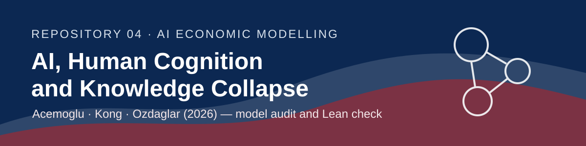

<p align="center">
  
</p>

<p align="center">
  <a href="paper/acemoglu-kong-ozdaglar-2026.pdf"></a>
  <a href="https://doi.org/10.3386/w34910"></a>
  <a href="presentation.pdf"></a>
  <a href="extra/presentation-long.pdf"></a>
  <a href="lean/"></a>
  <a href="LICENSE.md"></a>
</p>

<p align="center">
  
  
  
  
  
</p>

# AI, Human Cognition and Knowledge Collapse

**Daron Acemoglu, Dingwen Kong, and Asuman Ozdaglar (2026).** NBER Working Paper 34910, version dated May 5, 2026. It is an **unrefereed NBER working paper**, not an arXiv paper.

## Question and mechanism

The paper asks when better generative—and especially agentic—AI improves current decisions but damages the stock of knowledge that makes good future decisions possible.

Its single mechanism is a dynamic externality. Human effort jointly produces private, context-specific information and a thin public signal. Individuals internalize the private return but not the public contribution. General knowledge therefore **complements** effort; accurate context-specific AI **substitutes** for it and reduces the human signals entering tomorrow’s public knowledge.

## The agent’s problem

At date $t$, an atomistic, short-lived agent takes public precision $X_t$ and AI precision $\tau_A$ as given. She first chooses effort $e_{i,t}\ge 0$, then uses posterior means to predict the common and idiosyncratic states. Her idiosyncratic precision is

```math
Y_{i,t}=\sigma^{-2}+\lambda_I e_{i,t}+\tau_A.
```

Under Assumption 1, $\Delta_I=0$ and $\Delta_X>0$, expected utility reduces to

```math
U(e;X_t,\tau_A)=f(0,0)+G(X_t)\Delta_G+G(X_t)G(Y_{i,t})\Delta_X
-\frac{\varepsilon}{\varepsilon+1}e^{(\varepsilon+1)/\varepsilon}.
```

The unique best response satisfies, for $X_t>0$,

```math
\Delta_XG(X_t)\lambda_I g(Y_{i,t})=e_{i,t}^{1/\varepsilon},
```

with $G(z)=2\Phi(\sqrt z)-1$ and $g=G'$. At $X_t=0$, Assumption 1 instead implies the corner $e_{i,t}=0$.

## Main result and conditions

**Observation 1 (the course result).** For $X_t>0$, $\tau_A\ge0$, $\lambda_I>0$, $\Delta_X>0$, $Y_{i,t}>0$, and Gaussian signals,

```math
\frac{\partial^2 U}{\partial e\,\partial X_t}
=\Delta_X\lambda_I g(X_t)g(Y_{i,t})>0,
\qquad
\frac{\partial^2 U}{\partial e\,\partial\tau_A}
=\Delta_XG(X_t)\lambda_I g'(Y_{i,t})<0.
```

Thus public precision raises the marginal return to human effort, while more accurate context-specific AI lowers it. Observation 2 then gives $e(X,\tau_A)$ increasing in $X$ and decreasing in $\tau_A$, strictly for $X>0$.

**Proposition 1.** Given any initial $X_1\ge0$, the unique symmetric equilibrium is the recursion

```math
e_t=e(X_t,\tau_A),\qquad
X_{t+1}=\left[\Sigma^2+(X_t+\lambda_G I e_t)^{-1}\right]^{-1}.
```

**Proposition 2.** The transition map $F(X)$ is pointwise increasing in aggregation capacity $I$ and decreasing in agentic precision $\tau_A$, strictly for every $X>0$.

## What does not hold up automatically

The zero-knowledge trap relies on the unrelaxed production restriction $\Delta_I=0$. With standalone value from context-specific knowledge ($\Delta_I>0$), the marginal return to effort at $X=0$ is positive:

```math
\left.\frac{\partial U}{\partial e}\right|_{e=0,X=0}
=\Delta_I\lambda_I g(\sigma^{-2}+\tau_A)>0.
```

Therefore $e(0,\tau_A)>0$ and the next public precision is positive: exact collapse is no longer a fixed point. The model may still generate a **low-knowledge** regime, but not the baseline state $(X,e)=(0,0)$. Two further qualifications matter: Observation 1’s strict complementarity derivative is an interior $X>0$ statement, and Proposition 5 does not state what happens exactly at $\tau_A=\tau_A^c$. Full derivations and the welfare-accuracy audit are in [extensions.md](extensions.md).

## Repository map

```text
ai-04-acemoglu/
├── assets/
│   ├── header.svg
│   └── ako-beamer.sty
├── extra/
│   └── presentation-long.tex/.pdf   # 26-frame extension deck
├── hand/
│   ├── derivation.png               # image displayed in the short deck
│   ├── repo4_modelamineto_hand.pdf  # original handwritten page
│   └── README.md
├── lean/                            # complete EconCSLib run output
├── paper/
│   ├── README.md
│   └── acemoglu-kong-ozdaglar-2026.pdf
├── presentation.tex/.pdf            # five-frame reading-check deck
├── README.md
├── extensions.md
├── prompts.md
└── LICENSE.md
```

The handwritten audit is included in [`hand/`](hand/): the original PDF is preserved and a PNG rendering appears on the final slide.

The EconCSLib contribution is being completed under `lean/`. Its status is not
reported as verified until the course checker succeeds; see [lean/README.md](lean/README.md).

## Citation

Acemoglu, D., Kong, D., & Ozdaglar, A. (2026). *AI, Human Cognition and Knowledge Collapse*. NBER Working Paper 34910. <https://doi.org/10.3386/w34910>.
